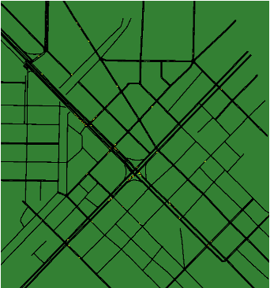

# 多跳車載網路叢集之貪婪演算法
## Multi-hop VANET-Clustering Algorithm Using Greedy Method

# 專題研究動機與目的
> 
> ## 動機
> > 各類行車輔助系統相繼出現，\
若每輛車必須提供即時行車數據給基地台，\
會造成基地台附近干擾增加，也會產生冗餘資訊，\
因此高穩定與高可靠的行車網路是必須的，\
而[1]所提出的叢集方法可有效解決此問題。
> ## 目的
> > 1. 降低整體叢集數量
> > 2. 提昇叢集平均成員數量
> > 3. 降低成員脫離叢集次數

# 實驗方法與流程
> 1. SUMO(Simulation of Urban MObility)取得行車數據
> 2. NS2(Network Simulator 2)依據行車數據生成封包傳輸資料
> 3. 依據封包傳輸資料模擬叢集運算
> 4. 輸出模擬數據，分析與比較不同叢集演算法之間的差異
> 
>  
>  

# 系統模型
> 我們的系統模型中假設每輛車具有唯一的身分識別碼(Identity Code, ID)並配備車載單元(Onboard Unit, OBU)，可以由全球定位系統(Global Position-ing System, GPS)獲取當前位置、速率與移動方向。本文使用之符號列於 表 1
> > - 表 1 符號表
> >  
> >  符號 | 定義
> >  |:-:|:-:|
> >  Tcollect | 計時器，期間車輛會傳輸及接收封包，並於到期時進行MPCS演算法
> >  Ci | 車輛i之識別碼
> >  State(i) | 車輛i的狀態
> >  Δx | 兩車的x座標距離差
> >  Δy | 兩車的y座標距離差
> >  ΔVx | 兩車的x方向速度差
> >  ΔVy | 兩車的y方向速度差
> >  Δθ | 兩車的行徑方向角度差
> >  TR | 最大封包傳遞範圍
> >  Clu(i) | 車輛i所在叢集編號
> >  Layer(i) | 車輛i所在叢集層數
> >  Pd | 於Tcollect期間接收失敗封包紀錄
> >  PCM | 於Tcollect期間接收CM車輛的封包
> >  PCH | 於Tcollect期間接收CH車輛的封包
> 
> 每輛車將被賦予一個狀態，分別為：初始節點(Initial Node, IN)、叢集成員(Cluster Member, CM)叢集首(Cluster Header, CH)並於Tcollect到期後於特定事件發生下轉換狀態
> 
> 如圖 1所示。其中CM分為parent與child，parent負責將自身與children的行車資訊向CH方向傳遞，此階層式架構能達到分散化所帶來的效果，每個parent只需要維護自己one-hop範圍內的children，節點的加入與退出都不需要經由CH認可，只需要與parent建立連線，此法可極大地降低與CH藉由multi-hop的通訊，且當parent因更換parent而更換叢集時也不必通知children。
> > - 圖 1 節點狀態轉換表
> >
> > 

# 車輛叢集
> 所有節點初始狀態皆為IN，節點開始移動前進行一次Tcollect，計時過程中進行接收邀請封包，內容列於表 2 :
> - 表 2 封包內容
> 
> 符號 | 定義
> |:-:|:-:|
> Time | 封包送出時間
> Ci | 車輛編號
> X | 車輛所在經度
> Y | 車輛所在緯度
> Vx | 東西向速度
> Vy | 南北向速度
> Layer(i) | 所在叢集層數
> State(i) | 車輛狀態
> Upper_LLT(i) | 車輛i的ancestor間平均LLT
> NodeNum(i) | 目前叢集成員數量
> 
> 當車輛Tcollect到期，即進行最大預測連線存活時間(Maximum Predicted Connection Survival time algorithm, MPCS) 演算法 1，其中車輛會根據自身狀態、PCM 、PCH與Pd進行不同決策
> 
> 若車輛的狀態為IN，於Tcollect過程中有接收到來自其他車輛的邀請封包，進行叢集挑選(Cluster Selection, CS)演算法(2)，選出具有最大預測連線數值的車輛與其連線，加入此叢集，並將自身狀態更新為CM，若沒有接收到任何邀請封包代表附近沒有已存在之叢集可加入，則建立新的叢集與基礎設施建立連線，並更換狀態為CH。
> 
> 若車輛狀態為CM，且Tcollect期間收到來自CM或CH的封包，進行叢集挑選(SC)演算法(2)挑選出最適合的newParent，如果newParent不是目前的parent，則與原本的parent斷開連線並與newParent連線，加入newParent所在叢集，否則保持與原parent的連線，如此車輛能保持與最合適的parent連線，CH也不必特別對連線不佳而影響到整體叢集品質的CM做維護。若期間沒有收到parent的封包，也沒有收到其他叢集的邀請封包，代表此子叢集已脫離主叢集，則建立新的叢集，改變狀態為CH，並與基礎設施建立連線。
