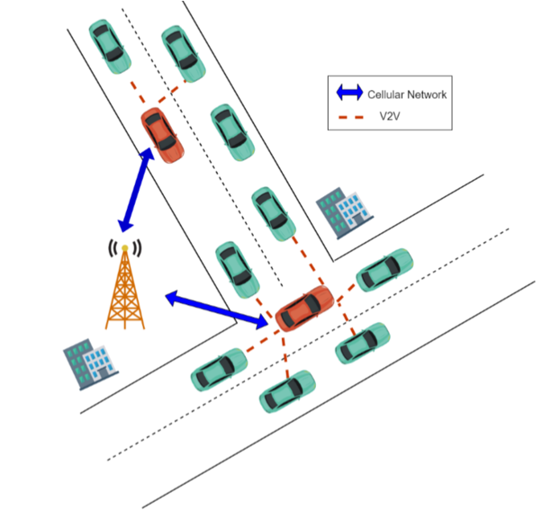
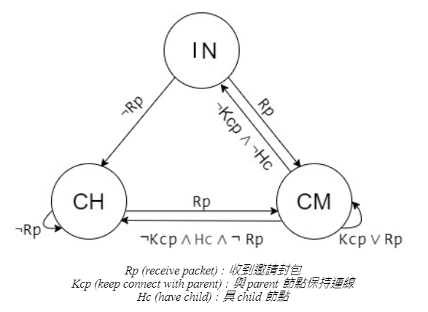
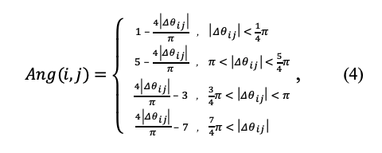

# 多跳車載網路叢集之貪婪演算法
## Multi-hop VANET-Clustering Algorithm Using Greedy Method
<hr>

# 緒論
> 
> > 欲透過車輛隨意網路(Vehicular Ad Hoc Net-work, VANET)提供服務，即時且高效的通訊系統是必須的，而目前通訊方式主要分為車輛對基礎設施(Vehicle-to-Infrastructure)，與車輛對車輛(Vehicle-to-Vehicle)[1][2]，其中兩者如何調配是值得考慮的，若所有車輛都直接與基礎設施通訊，基礎設施接收訊號時會受到大量干擾與過多的冗餘資訊，因此鄰近車輛若能將彼此行車資訊整理後，再由指定車輛與基礎設施進行通訊，則可降低資訊冗餘提昇通訊品質。
> >
> > 由於行車的高機動性與分佈不均性，建立穩定的通訊管理十分不易，然而叢集方法已被證明於提高可靠性及擴展性具有相當的成效[4]。叢集由一個叢集首負責管理叢集內成員的通信，並且由其負責與基礎設施和其他叢集首溝通，然而最初的叢集方法是針對移動隨意網路(mobile ad hoc network, MANET)而設計，對於行車的移動快速、變動的拓撲、限制的移動、極高的延伸性、節點間的易斷線性等[5]原因，原本於移動隨意網路的叢集演算法，必須根據其特性進行調整。本文將提出一個基於貪婪演算法(Greedy Algorithm)與階層式架構(Hierarchical Structure)以降低進行叢集所帶來的額外負擔，並以最大預測連線存活演算法(Maximum Predicted Connection Survival time algorithm, MPCS)，作為節點進行各項叢集活動的量化指標。
> >
> ## 本文貢獻
> > 1. 使用階層式架構達到一定的分散性，降低CH與CM間因叢集所帶來的額外傳輸成本
> > 2. 提出基於連線存活時間與行徑方向的量化指標，作為節點狀態改變及叢集挑選的依據
> > 3. 藉由定時叢集挑選，使節點與節點間保持最佳連線狀態
> > 4. 叢集首定時測試與叢集成員之連線，以維護叢集整體連線品質
> >  

# 系統模型
> 我們的系統模型中假設每輛車具有唯一的身分識別碼(Identity Code, ID)並配備車載單元(Onboard Unit, OBU)，可以由全球定位系統(Global Position-ing System, GPS)獲取當前位置、速率與移動方向。本文使用之符號列於 表 1
> > - 表 1 符號表
> >  
> >  符號 | 定義
> >  |:-:|:-:|
> >  Tcollect | 計時器，期間車輛會傳輸及接收封包，並於到期時進行MPCS演算法
> >  Ci | 車輛i之識別碼
> >  State(i) | 車輛i的狀態
> >  Δx | 兩車的x座標距離差
> >  Δy | 兩車的y座標距離差
> >  ΔVx | 兩車的x方向速度差
> >  ΔVy | 兩車的y方向速度差
> >  Δθ | 兩車的行徑方向角度差
> >  TR | 最大封包傳遞範圍
> >  Clu(i) | 車輛i所在叢集編號
> >  Layer(i) | 車輛i所在叢集層數
> >  Pd | 於Tcollect期間接收失敗封包紀錄
> >  PCM | 於Tcollect期間接收CM車輛的封包
> >  PCH | 於Tcollect期間接收CH車輛的封包
> 
> 每輛車將被賦予一個狀態，分別為：初始節點(Initial Node, IN)、叢集成員(Cluster Member, CM)叢集首(Cluster Header, CH)並於Tcollect到期後於特定事件發生下轉換狀態
> 
> 如圖 1所示。其中CM分為parent與child，parent負責將自身與children的行車資訊向CH方向傳遞，此階層式架構能達到分散化所帶來的效果，每個parent只需要維護自己one-hop範圍內的children，節點的加入與退出都不需要經由CH認可，只需要與parent建立連線，此法可極大地降低與CH藉由multi-hop的通訊，且當parent因更換parent而更換叢集時也不必通知children。
> > - 圖 1 節點狀態轉換表
> >
> > 

# 車輛叢集
> 所有節點初始狀態皆為IN，節點開始移動前進行一次Tcollect，計時過程中進行接收邀請封包，內容列於表 2 :
> - 表 2 封包內容
> 
> 符號 | 定義
> |:-:|:-:|
> Time | 封包送出時間
> Ci | 車輛編號
> X | 車輛所在經度
> Y | 車輛所在緯度
> Vx | 東西向速度
> Vy | 南北向速度
> Layer(i) | 所在叢集層數
> State(i) | 車輛狀態
> Upper_LLT(i) | 車輛i的ancestor間平均LLT
> NodeNum(i) | 目前叢集成員數量
> 
> 當車輛Tcollect到期，即進行最大預測連線存活時間(Maximum Predicted Connection Survival time algorithm, MPCS) 演算法 1，其中車輛會根據自身狀態、PCM 、PCH與Pd進行不同決策
> 
> 若車輛的狀態為IN，於Tcollect過程中有接收到來自其他車輛的邀請封包，進行叢集挑選(Cluster Selection, CS)演算法(2)，選出具有最大預測連線數值的車輛與其連線，加入此叢集，並將自身狀態更新為CM，若沒有接收到任何邀請封包代表附近沒有已存在之叢集可加入，則建立新的叢集與基礎設施建立連線，並更換狀態為CH。
> 
> 若車輛狀態為CM，且Tcollect期間收到來自CM或CH的封包，進行叢集挑選(SC)演算法(2)挑選出最適合的newParent，如果newParent不是目前的parent，則與原本的parent斷開連線並與newParent連線，加入newParent所在叢集，否則保持與原parent的連線，如此車輛能保持與最合適的parent連線，CH也不必特別對連線不佳而影響到整體叢集品質的CM做維護。若期間沒有收到parent的封包，也沒有收到其他叢集的邀請封包，代表此子叢集已脫離主叢集，則建立新的叢集，改變狀態為CH，並與基礎設施建立連線。
> 
> 若車輛狀態為CH，且期間有收到來自其他叢集的邀請封包，將經過叢集挑選(SC) 演算法 2 挑選出最適合的newParent，若判斷合併後不超出叢集最大成員限制、層數限制，則進行Upper_LLT比較，由具有較小Upper_LLT的節點向另一節點合併，並將加入節點狀態更改為CM。
> 
> > - 演算法 1 最大預測連線存活時間 (Maximum Predicted Connection Survival time algorithm, MPCS)
> > ```
> > IF C.Tcollect is Time Up OR Force THEN
> >     IF C.state is “IN” THEN
> >         IF C receive pak from other cars THEN
> >             LET newParent_list TO CS(C)
> >             FOR newParent IN newParent_list DO
> >                 IF two clusters could be merge THEN
> >                     CAR_CONNECT(C, newParent)
> >                     C join newParent.cluster
> >                     C change state to CM
> >                     LET join_flag TO TRUE
> >                     BREAK
> >                 END IF
> >             END FOR
> >         ELSE
> >             LET newClu TO CLUSTER_CREATE(C)
> >             C join newClu
> >             C change state to CH
> >         END IF
> > 
> >     ELSE IF C.state is “CM” THEN
> >         IF C receive any pak THEN
> >             LET newParent_list TO CS(C)
> >             FOR newParent IN newParent_list DO
> >                 IF two clusters could be merged AND newParent is not C.child THEN
> >                     CAR_DISCONNECT(C, parent)
> >                     CAR_CONNECT(C, newParent)
> >                     C join newParent.cluster
> >                 END IF
> >             END FOR
> >         ELSE
> >             LET newClu TO CLUSTER_CREATE(C)
> >             C join newClu
> >             C change state to CH
> >         END IF
> > 
> >     ELSE IF C.state is “CH” THEN
> >         IF C receive pak from other cluster THEN
> >             LET newParent_list TO CS(C)
> >             FOR newParent  IN newParent_list DO
> >                 IF two clusters could be merge THEN
> >                     IF newParent.Upper_LLT > C.Upper_LLT THEN
> >                         CAR_CONNECT(C, newParent)
> >                         C join to newParent.cluster
> >                         C change state to CM
> >                         BREAK
> >                     ELSE IF newParent.Upper_LLT < C.Upper_LLT THEN
> >                         CAR_CONNECT(newParent, C)
> >                         newParent join to C.cluster 
> >                         newParent change state to CM
> >                         BREAK
> >                     END IF
> >                 END IF
> >             END FOR
> >         END IF
> >     END IF
> > END IF
> > ```

# 叢集選擇
> 參考LLT[8] (1)式，加入行徑方向與其他因素，以作為節點選擇叢集時的量化指標，並以叢集選擇 演算法 2 取得newParent_list、實現以基於叢集首備份方法(BackUp Cluster Head, BUCH)[6]的newParent_list備份方案，當child與原parent發生意外斷線時，可快取此列表中的下一parent。
> 
> 
> 
> 於原LLT(1)式中加入Upper_LLT(2)式，以評判車輛與newParent預測連線存活時間的相對好壞(3)式：
> 
> 
> 
> 若兩車行徑方向夾角(∆θ)於一定範圍內，給予方向夾角比例的額外獎勵，若於反向範圍則給予懲罰(4)式：
> 
> 
> 
> 為了降低叢集的變動，若兩車為同一叢集則獲得額外獎勵(5)式:
> 
> 
> 
> 叢集選擇 演算法 2 中，以接收到的邀請封包與傳輸失敗的封包之差，為原始預測連線存活參數(predicted connection survival time argument, pcs)，由(3)式、(4)式、(5)式進行獎勵與懲罰，其中為了調整每式造成的影響程度，加入LLTF、ANGF、SCF參數。
> > 演算法 2  叢集選擇 (Cluster Selection algorithm, SC) 
> >
> > ```
> > LET cand_map TO EMPTY_MAP
> > FOR Cn IN C.Pcm, C.Pch DO 
> >     IF Cn NOT IN cand_map THEN
> >         LET pos_pak TO pak number sent from Cn
> >         LET neg_pak TO pak number drop from Cn
> >         LET pcs TO pos_pak – neg_pak
> > 
> >         IF dLLT(C, Cn) > 0 THEN
> >             pcs += ln(dLLT(C, Cn)) * LLTF * pcs
> >         ELSE IF dLLT(C, Cn) < 0 THEN
> >             pcs -= ln(-dLLT(C, Cn)) * LLTF * pcs
> >         END IF
> >         pcs += Ang(C, Cn) * ANGF * pcs
> >         pcs += SC(C, Cn) * SCF * pcs
> >         cand_map ADD {Cn : pcs}
> > END FOR
> > RETURN cand_Map
> > ```

# 連線維護